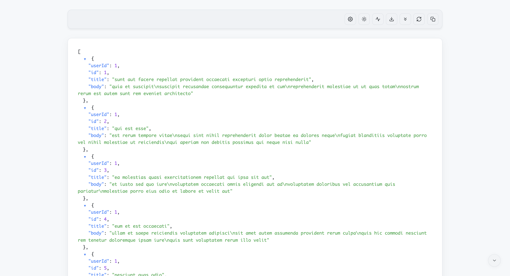
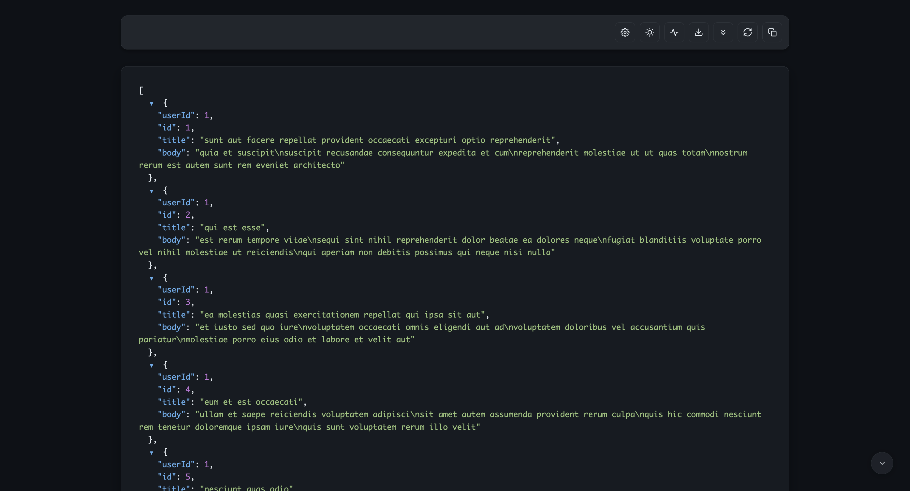
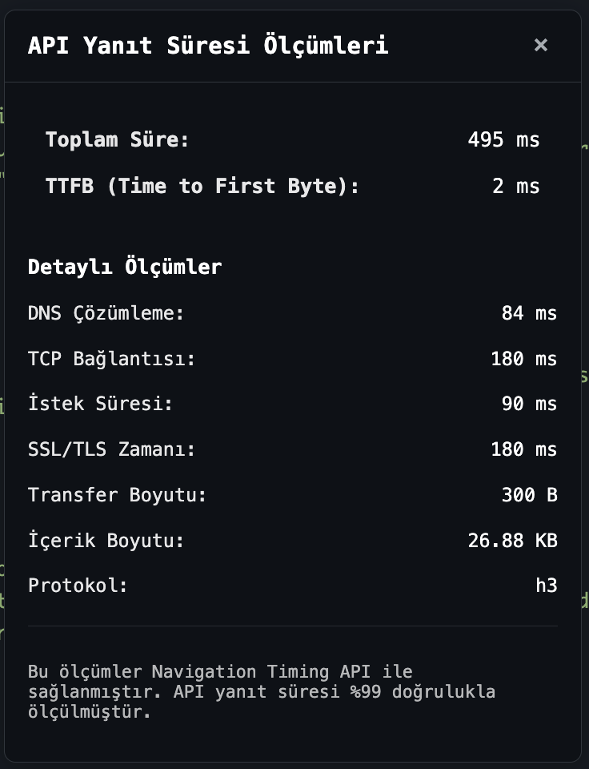
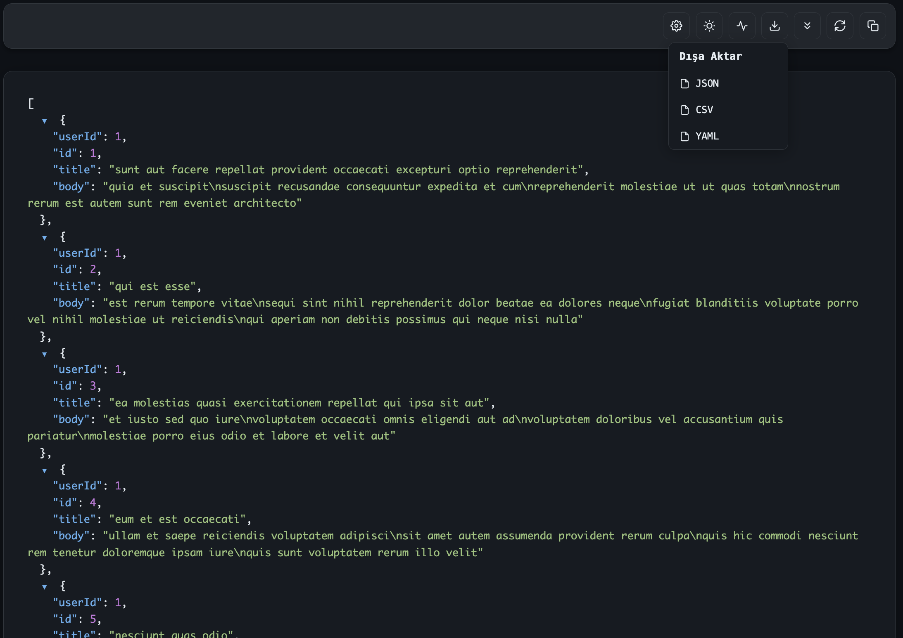
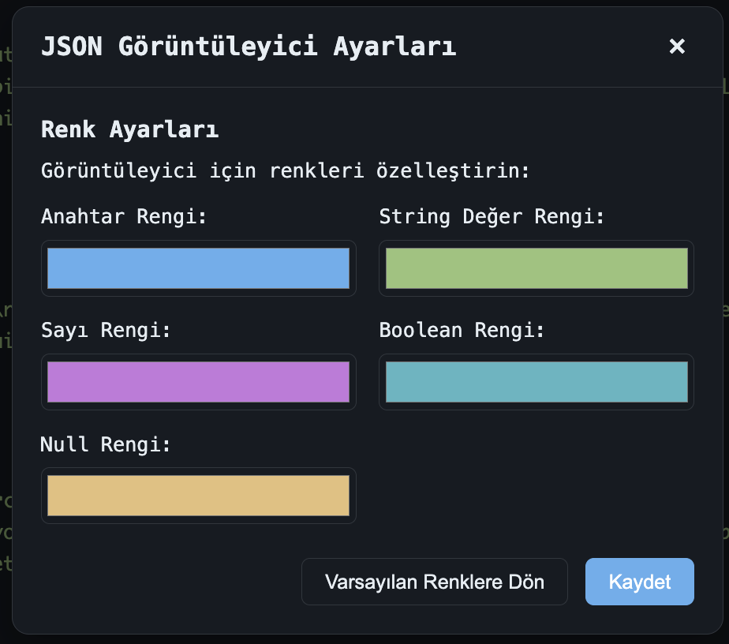

# JSON Görüntüleyici Pro

  

JSON Görüntüleyici Pro, tarayıcınızda JSON verilerini modern, okunaklı ve estetik bir şekilde görüntülemenizi sağlayan bir tarayıcı eklentisidir.

## Ekran Görüntüleri

  <h3>Açık Tema</h3>
  

  <h3>Koyu Tema</h3>
  

  <h3>API Performans Metrikleri</h3>
  

  <h3>Dışa Aktarma Seçenekleri</h3>
  

  <h3>Ayarlar Paneli</h3>
  

## Özellikler

- ✨ **Modern Arayüz**: Şık ve kullanıcı dostu bir arayüz ile JSON verileri daha okunaklı hale gelir
- 🎨 **Sözdizimi Vurgulama**: JSON yapısını renkli bir şekilde görüntüleyerek anlaşılırlığı artırır
- 🌓 **Karanlık/Açık Tema**: Gözlerinizi yormayan, tercih ettiğiniz temayı seçin
- 📊 **Performans Ölçümü**: API yanıt süresi ve diğer performans metriklerini %99 doğrulukla görüntüleme
- 📁 **Açılır-Kapanır Bölümler**: Karmaşık JSON yapılarını açılır-kapanır bölümlerle daha kolay gezinin
- 💾 **Dışa Aktarma Seçenekleri**: JSON verilerinizi farklı formatlarda (CSV, YAML) dışa aktarın
- 📋 **Kolay Kopyalama**: Tek tıklamayla tüm JSON içeriğini kopyalayın

## Kurulum

1. Tarayıcınızın eklenti mağazasından "JSON Görüntüleyici Pro" eklentisini arayın
2. "Yükle" veya "Chrome'a Ekle" butonuna tıklayın
3. Kurulum tamamlandığında, tarayıcınızda otomatik olarak aktif hale gelecektir

## Kullanım

1. Herhangi bir JSON içeren sayfayı ziyaret edin (API yanıtları, .json dosyaları vb.)
2. Eklenti otomatik olarak JSON içeriğini algılayacak ve güzelleştirilmiş bir görünüm sunacaktır
3. Araç çubuğundaki düğmeleri kullanarak çeşitli işlevlere erişin:
   - Tema değiştirme (karanlık/açık)
   - Performans metriklerini görüntüleme
   - JSON verilerini dışa aktarma
   - Tüm bölümleri genişletme/daraltma
   - Sayfayı yenileme
   - Tüm içeriği kopyalama

## Ayarlar

Araç çubuğundaki ayarlar simgesine tıklayarak:
- Renk şemasını özelleştirin
- Yazı tipi boyutunu değiştirin
- Performans göstergelerini yapılandırın

## Geliştirici Bilgileri

Bu eklenti aşağıdaki teknolojileri kullanmaktadır:
- JavaScript (ES6+)
- HTML5 ve CSS3
- Chrome/Firefox Uzantı API'leri

## Gizlilik

JSON Görüntüleyici Pro:
- Hiçbir veriyi sunucularla paylaşmaz
- Tüm işlemler tarayıcınızda yerel olarak gerçekleşir
- Hiçbir kişisel bilgi toplamaz veya saklamaz

## Lisans

Bu eklenti [MIT Lisansı](LICENSE) altında lisanslanmıştır.

## İletişim

Geri bildirim, öneriler veya hata raporları için lütfen GitHub üzerinden bir issue açın veya bize e-posta gönderin.

---

  
JSON verilerinizi daha güzel görüntüleyin

  
Sürüm 1.1

